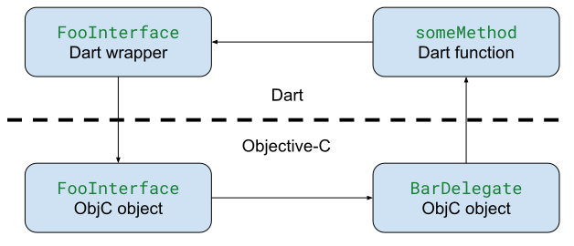

# Objective-C memory management considerations

Objective-C uses reference counting to delete objects that are no longer in
use, and Dart uses garbage collection (GC) for this. The Dart wrapper objects
that wrap Objective-C objects automatically increment the reference count
when the wrapper is created, and decrement it when the wrapper is destroyed.

For the most part this is all automatic and you don't need to worry about it.
But there are two main ways that memory can leak during Objective-C interop.

## Reference Cycles

When using blocks or protocols, it's possible to create reference
cycles that will prevent these objects from being cleaned up. If a
block/protocol method closes over a wrapper object that holds a reference
to the block/protocol, this cycle will cause a memory leak. This example
uses a protocol, but the same thing can happen with a block:

<!-- file://./../tool/snippets/objc_gc_snippet.dart#cycle -->
```dart
final foo = FooInterface();
foo.delegate = BarDelegate.implement(
  someMethod: () {
    foo.anotherMethod();
  },
);
```

`foo.delegate` is holding a reference to a `BarDelegate` whose
`someMethod` implementation is a Dart function which implicitly
holds a reference to the `foo`. If this was all pure Dart code, the
garbage collector would be able to clean up this reference cycle, but
since `FooInterface` and `BarDelegate` are both Objective-C types this will
leak memory.



To break this cycle, the method implementation must hold `foo` as a
`WeakReference`, but it's even better to write your methods to avoid the
need for things like this. To ensure the method doesn't capture anything
unexpected, it's also a good idea to move its construction to a separate
function.

<!-- file://./../tool/snippets/objc_gc_snippet.dart#weak_ref -->
```dart
BarDelegate createBarDelegate(WeakReference<FooInterface> weakFoo) {
  return BarDelegate.implement(
    someMethod: () {
      weakFoo.target?.anotherMethod();
    },
  );
}

void main() {
  final foo = FooInterface();
  foo.delegate = createBarDelegate(WeakReference(foo));
}
```

## Autoreleased References

Objective-C has a mechanism where references can be autoreleased, which means
they are placed in an [autorelease pool](
https://developer.apple.com/library/archive/documentation/Cocoa/Conceptual/MemoryMgmt/Articles/mmAutoreleasePools.html).
Autorelease pools form a stack, and autoreleased references are placed in the
top-most pool.
When that pool is destroyed, all the references it contains are released.
If the pool is too long-lived, these references are effectively leaked.

Autoreleasing is primarily used for returning results from methods. If you
invoke a method that returns an object reference, it's likely that it was
autoreleased (unless it's an `alloc`, `init`, `new`, or `copy` method).
Additionally, the Objective-C API you're invoking may also create autoreleased
references internally.
So you may be creating these references without knowing it.

In native Objective-C apps, and Flutter apps, autorelease pools are
created and destroyed at event loop boundaries (e.g. every frame).
So this is usually not a problem.
However, until Dart 3.14 (Flutter 3.50), Flutter background isolates
did not have an autorelease pool in their event loop.
This also affected *all* isolates in Dart CLI apps.

Even if you have an autorelease pool around the event loop,
autoreleased references won't be cleaned up until the next event loop cycle
(eg at an `async`/`await` boundary, or after a message handler).
If you have a long running block of synchronous code,
autoreleased references may pile up, holding on to memory that should be freed.

The fix to these problems, just like in Objective-C code,
is to use an autorelese pool.
The Dart API for this is [`autoReleasePool`](
https://pub.dev/documentation/objective_c/latest/objective_c/autoReleasePool.html).
