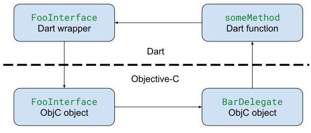

# Objective-C memory management considerations

Objective-C uses reference counting to delete objects that are no longer in
use, and Dart uses garbage collection (GC) for this. The Dart wrapper objects
that wrap Objective-C objects automatically increment the reference count
when the wrapper is created, and decrement it when the wrapper is destroyed.
For the most part this is all automatic and you don't need to worry about it.

However, when using blocks or protocols, it's possible to create reference
cycles that will prevent these objects from being cleaned up. If a
block/protocol method closes over a wrapper object that holds a reference
to the block/protocol, this cycle will cause a memory leak. This example
uses a protocol, but the same thing can happen with a block:

```dart
final foo = FooInterface();
foo.delegate = BarDelegate.implement(
  someMethod: () {
    foo.anotherMethod();
  }
);
```

`foo.delegate` is holding a reference to a `BarDelegate` whose
`someMethod` implementation is a Dart function which implicitly
holds a reference to the `foo`. If this was all pure Dart code, the
garbage collector would be able to clean up this reference cycle, but
since `FooInterface` and `BarDelegate` are both Objective-C types this will
leak memory.



To break this cycle, the method implementation must hold `foo` as a
`WeakReference`, but it's even better to write your methods to avoid the
need for things like this. To ensure the method doesn't capture anything
unexpected, it's also a good idea to move its construction to a separate
function.

```dart
BarDelegate createBarDelegate(WeakReference<FooInterface> weakFoo) {
  return BarDelegate.implement(
    someMethod: () {
      weakFoo.target?.anotherMethod();
    }
  );
}

final foo = FooInterface();
foo.delegate = createBarDelegate(WeakReference(foo));
```
