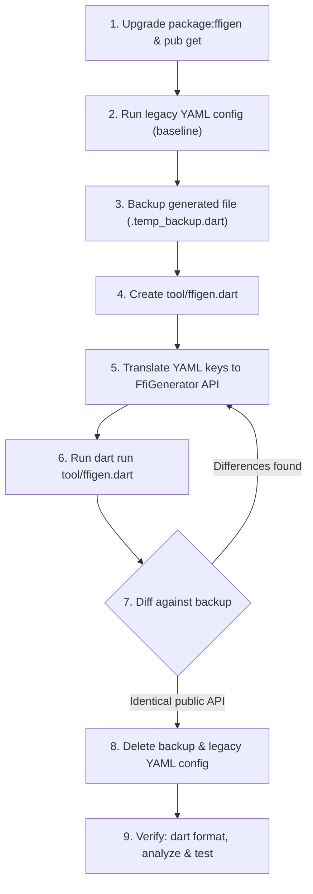

# Migrating FFIgen YAML Configuration to Modern Dart Code

## Contents
- [Introduction & Motivation](#introduction--motivation)
- [Step-by-Step Migration Workflow](#step-by-step-migration-workflow)
- [Comprehensive YAML to Dart API Mapping](#comprehensive-yaml-to-dart-api-mapping)
  - [1. General & Clang Settings](#1-general--clang-settings)
  - [2. Output Configuration](#2-output-configuration)
  - [3. Binding Styles & Library Settings](#3-binding-styles--library-settings)
  - [4. Declaration Filters & Renaming](#4-declaration-filters--renaming)
  - [5. Category-Specific Settings](#5-category-specific-settings)
  - [6. Symbol Files & Type Mappings](#6-symbol-files--type-mappings)
  - [7. Objective-C Configuration](#7-objective-c-configuration)
  - [8. Obsolete & Ignored YAML Fields](#8-obsolete--ignored-yaml-fields)
  - [9. Modern Dart-Only Features](#9-modern-dart-only-features)
- [Before & After Migration Examples](#before--after-migration-examples)
  - [Example 1: Dynamic Library C Bindings](#example-1-dynamic-library-c-bindings)
  - [Example 2: Modern Static Native External Bindings](#example-2-modern-static-native-external-bindings)
  - [Example 3: Objective-C Framework Bindings](#example-3-objective-c-framework-bindings)
- [Verification Checklist](#verification-checklist)
- [Troubleshooting & Common Pitfalls](#troubleshooting--common-pitfalls)

---

## Introduction & Motivation

Historically, `package:ffigen` relied on a static YAML configuration specified either in `ffigen.yaml` or under the `ffigen:` key in `pubspec.yaml`, executed via `dart run ffigen`.

Starting with `ffigen` 16+, programmatic code configuration via `FfiGenerator` in a Dart script (typically `tool/ffigen.dart`) is the standard and recommended approach:
1. **Compile-Time Safety & Autocomplete**: Benefit from static typing, IDE code completion, and immediate compile-time errors instead of cryptic runtime YAML parsing failures.
2. **Full Dart Power**: Use arbitrary Dart logic (loops, sets, custom regular expressions, closures, transformations) inside AST `Visitor`s rather than dealing with fragile YAML regex mappings.
3. **Future Proofing**: YAML configuration support is being deprecated and phased out in favor of the programmatic Dart API.
4. **Advanced Features**: Direct access to modern features such as `@RecordUse` tree-shaking maps (`recordUseMapping`), experimental C++ support (`Cpp`), and composable symbol file loaders (`importFromSymbolFiles`).

---

## Step-by-Step Migration Workflow

Follow this systematic 9-step workflow to migrate any package from YAML configuration to a modern Dart generator script without introducing breaking changes or unintended diffs:



### Step 1: Upgrade `package:ffigen` and Update Dependencies
Ensure the package has the latest `ffigen` dependency under `dev_dependencies` in `pubspec.yaml`:
```bash
dart pub add dev:ffigen
```
Run `dart pub get` to ensure all lockfiles and dependencies are up to date.

### Step 2: Establish a Clean Baseline
Before making any changes, run the existing legacy YAML generator to ensure that the current bindings are cleanly generated and reproducible:
```bash
# If config is in pubspec.yaml or ffigen.yaml:
dart run ffigen

# Or if a custom config file was used:
dart run ffigen --config config.yaml
```
Verify that `git status` reflects a clean working tree (or commit existing changes first). If there are significant changes to the bindings output due to upgrading ffigen, inform the user.

### Step 3: Copy Existing Generated Bindings to a Temporary Backup
Make a temporary copy of every generated file so that the newly generated bindings can be diffed line-by-line. For example:
```bash
cp lib/src/generated_bindings.dart lib/src/generated_bindings.temp_backup.dart
```
*(If Objective-C `.m` files or symbol files are also generated, back them up as well).*

### Step 4: Create the Dart Configuration Script
Create the generator script at `tool/ffigen.dart`:

```dart
import 'dart:io';
import 'package:ffigen/ffigen.dart';

Future<void> main() async {
  final packageRoot = Platform.script.resolve('../');
  final generator = FfiGenerator(
    // Configuration translated in Step 5...
  );
  await generator.generate();
}
```

### Step 5: Translate YAML Keys into Modern Dart API
Inspect the YAML configuration and systematically translate each section into `FfiGenerator` parameters using the [Comprehensive YAML to Dart API Mapping](#comprehensive-yaml-to-dart-api-mapping) below.

The most important change is that filtering and renaming is now performed using `Visitor`s, and the default behavior is to *exclude* all top level bindings.

### Step 6: Execute the New Generator Script
Run the newly created generator script from the package root:
```bash
dart run tool/ffigen.dart
```

### Step 7: Diff Newly Generated Bindings Against the Backup
Compare the new output with the temporary backup. Do this for each binding file if there are multiple files. For example:
```bash
git diff --no-index lib/src/generated_bindings.temp_backup.dart lib/src/generated_bindings.dart
```
**Verification rules**:
- **Allowed diffs**: Trivial differences such as formatting, renaming of internal-only methods, reordering of the bindings, or the names of positional parameters.
- **Forbidden diffs**: Any differences in public APIs, class names, method signatures, struct fields, enum constants, native types, leaf annotations, packing annotations, or exposed addresses. It's critical that there are no breaking changes, but we also don't want to add new classes or methods unnecessarily.
- If unintended diffs exist, adjust the script and re-run until the diff is clean.

### Step 8: Clean Up Legacy Files and References
1. Delete the temporary backup file:
   ```bash
   rm lib/src/generated_bindings.temp_backup.dart
   ```
2. Remove the legacy YAML configuration:
   - If using `ffigen.yaml`, delete the file (`rm ffigen.yaml`).
   - If the configuration is inside `pubspec.yaml`, remove the `ffigen:` section entirely.
3. Update repository scripts and documentation:
   - Update any `README.md` instructions referencing `dart run ffigen` to `dart run tool/ffigen.dart`.
   - Update any CI workflows (e.g., `.github/workflows/*.yml`), Makefile targets, or build scripts to invoke `dart run tool/ffigen.dart`.

### Step 9: Final Verification Loop (Format, Analyze, Test)
Execute the complete Dart verification suite in the target package root:
1. **Format code**:
   ```bash
   dart format .
   ```
   Ensures both `tool/ffigen.dart` and generated files adhere to canonical Dart formatting.
2. **Static analysis**:
   ```bash
   dart analyze
   ```
   Ensures zero errors, warnings, or lints across the entire package. If generated bindings trigger lints, append the appropriate `// ignore_for_file:` directives to the `preamble` of `Output` in `tool/ffigen.dart` (never disable lints globally in `analysis_options.yaml`).
3. **Run tests**:
   ```bash
   dart test
   ```
   Ensures all unit, integration, and FFI tests execute and pass cleanly.

---

## Comprehensive YAML to Dart API Mapping

### 1. General & Clang Settings

| Legacy YAML Key | Type | Modern Dart API Equivalent | Notes |
| :--- | :--- | :--- | :--- |
| `headers.entry-points` | `List<String>` | `Input(entryPoints: [packageRoot.resolve('header.h')])` | Takes `List<Uri>`. Globs can be resolved via `Directory.listSync()` or explicit file lists. |
| `headers.include-directives` | `List<String>` | `Input(include: (Uri header) => bool)` | Filter closure to include/exclude transitively imported headers. |
| `compiler-opts` | `String` or `List<String>` | `Input(compilerOptions: ['-I/path', ...])` | List of command-line compiler options passed directly to libclang. |
| `compiler-opts-automatic.macos.include-c-standard-library` | `bool` | `defaultCompilerOpts(Logger.root, macIncludeStdLib: true)` | Automatically includes macOS standard library headers when compiling with Clang on macOS. |
| `ignore-source-errors` | `bool` | `Input(ignoreSourceErrors: true)` | Silences compiler warnings/errors occurring inside native source headers. |
| `llvm-path` | `List<String>` | `FfiGenerator(..., libclangDylib: Uri.file('/path/to/libclang.dylib'))` | Custom libclang path. By default, FFIgen automatically locates libclang on Linux, macOS, and Windows. |
| `language` | `'c'` or `'objc'` | `FfiGenerator(objectiveC: const ObjectiveC())` | Set `objectiveC` to enable Objective-C parsing. Default (`null`) is C. |

### 2. Output Configuration

| Legacy YAML Key | Type | Modern Dart API Equivalent | Notes |
| :--- | :--- | :--- | :--- |
| `output` (string) | `String` | `Output(dart: DartOutput(path: packageRoot.resolve('bindings.dart')))` | Primary Dart bindings output path. |
| `output.bindings` | `String` | `Output(dart: DartOutput(path: packageRoot.resolve('bindings.dart')))` | Output Dart file when `output` is a map. |
| `output.objc-bindings` | `String` | `Output(..., objectiveCFile: packageRoot.resolve('bindings.m'))` | Objective-C implementation glue file (defaults to `${dart.path}.m`). |
| `output.symbol-file.output` & `output.symbol-file.import-path` | `Map` | `Output(symbolFile: SymbolFile(Uri.parse('package:pkg/bindings.dart'), packageRoot.resolve('symbols.yaml')))` | Exports symbols for reuse by downstream packages. |
| `preamble` | `String` | `Output(preamble: '...')` | Header string injected at the top of the generated file (license, lints suppression). |

### 3. Binding Styles & Library Settings

| Legacy YAML Key | Type | Modern Dart API Equivalent | Notes |
| :--- | :--- | :--- | :--- |
| `ffi-native` | `Map` or empty | `Output(style: const NativeExternalBindings(assetId: '...'))` | Generates `@Native` external functions for `dart:ffi`. |
| `ffi-native.asset-id` | `String` | `NativeExternalBindings(assetId: 'package:my_pkg/asset')` | Asset identifier for native assets loading. |
| `name` | `String` | `DynamicLibraryBindings(wrapperName: 'MyLib')` | Class name when using dynamic library binding style. Default is `NativeLibrary`. |
| `description` | `String` | `DynamicLibraryBindings(wrapperDocComment: 'Bindings to MyLib.')` | Documentation comment placed on the generated wrapper class. |
| `comments` | `bool` or `Map` | `Output(commentType: CommentType(...))` | Configures doc comments: `CommentType.none()`, `CommentType.def()`, or `CommentType(CommentStyle.any, CommentLength.full)`. |

### 4. Declaration Filters & Renaming

In YAML, filters and renames were configured with string matching and regex maps under declaration keys. In the Dart API, all filtering and renaming occurs inside the `visitors: [Visitor(...)]` list. All top level nodes are excluded by default.

| Legacy YAML Feature | Modern Dart `Visitor` Implementation |
| :--- | :--- |
| `exclude-all-by-default: true` | Do not set `node.isIncluded = true` generally; only set `node.isIncluded = true` on desired nodes. |
| `functions.include: ['funcA', 'prefix_.*']` | `Visitor(func: (node) { if (node.name == 'funcA' \|\| node.name.startsWith('prefix_')) node.isIncluded = true; })` |
| `functions.exclude: ['dispose']` | `Visitor(func: (node) { if (node.name == 'dispose') node.isIncluded = false; })` |
| `structs.rename: {'_(.*)': '$1'}` | `Visitor(struct: (node) { if (node.name.startsWith('_')) node.name = node.name.substring(1); })` |
| `structs.member-rename: {'.*': {'_(.*)': '$1'}}` | `Visitor(field: (node) { if (node.name.startsWith('_')) node.name = node.name.substring(1); })` |
| `enums.member-rename: {'MyEnum': {'kValue': 'value'}}` | `Visitor(enumConstant: (node) { if (node.parent.originalName == 'MyEnum' && node.name == 'kValue') node.name = 'value'; })` |
| `functions.member-rename` (parameter rename) | `Visitor(param: (node) { if (node.parent.originalName == 'myFunc' && node.name == 'in') node.name = 'input'; })` |

### 5. Category-Specific Settings

| Legacy YAML Key | Type | Modern Dart API Equivalent |
| :--- | :--- | :--- |
| `functions.leaf` | Include/Exclude | `Visitor(func: (node) { if (node.name == 'fastFunc') node.isLeaf = true; })` |
| `functions.symbol-address` | Include/Exclude | `Visitor(func: (node) { if (node.name == 'sum') node.exposeSymbolAddress = true; })` |
| `functions.expose-typedefs` | Include/Exclude | `Visitor(func: (node) { if (node.name == 'callback') node.generateTypedefs = true; })` |
| `functions.variadic-arguments` | Map | `Visitor(func: (node) { if (node.originalName == 'printf') node.varArgs = [VarArgFunction(postfix: 'int', types: ['int'])]; })` |
| `structs.pack` | Map (`1`, `2`, `4`, `8`, `16`) | `Visitor(struct: (node) { if (node.originalName == 'PackedStruct') node.pack = 1; })` |
| `structs.dependency-only` | `'full'` or `'opaque'` | `Visitor(struct: (node) { node.dependencies = CompoundDependencies.opaque; })` |
| `unions.dependency-only` | `'full'` or `'opaque'` | `Visitor(union: (node) { node.dependencies = CompoundDependencies.opaque; })` |
| `enums.as-int` | Include/Exclude | `Visitor(enumClass: (node) { if (node.originalName == 'Flags') node.style = EnumStyle.intConstants; })` |
| `unnamed-enums.as-int` | Include/Exclude | Unnamed enums are naturally generated as constants; filter via `Visitor(unnamedEnumConstant: (node) => ...)`. |
| `silence-enum-warning` | `bool` | `Visitor(enumClass: (node) => node.silenceWarning = true)` |
| `globals.symbol-address` | Include/Exclude | `Visitor(global: (node) { if (node.name == 'errno') node.exposeSymbolAddress = true; })` |
| `typedefs.include` / `exclude` | Include/Exclude | `Visitor(typealias: (node) { node.isIncluded = TypealiasInclude.ifUsed; })` |
| `include-unused-typedefs: true` | `bool` | `Visitor(typealias: (node) { node.isIncluded = TypealiasInclude.always; })` |

### 6. Symbol Files & Type Mappings

#### Sharing Symbols across packages (`import.symbol-files`)
In legacy YAML:
```yaml
import:
  symbol-files:
    - 'package:other_pkg/symbols.yaml'
```
In modern Dart API:
```dart
FfiGenerator(
  // ...
  importType: importFromSymbolFile(packageRoot.resolve('path/to/symbols.yaml')),
  // Or multiple files:
  // importType: importFromSymbolFiles([packageRoot.resolve('symbols1.yaml'), ...]),
)
```

#### Custom Type Mappings (`type-map` and `library-imports`)
In legacy YAML:
```yaml
library-imports:
  custom_types: 'package:my_pkg/src/custom_types.dart'
type-map:
  'typedefs':
    'my_custom_int':
      'lib': 'custom_types'
      'c-type': 'MyCustomInt'
      'dart-type': 'int'
```
In modern Dart API, use the `importType` closure:
```dart
final customTypesImport = LibraryImport('custom_types', 'package:my_pkg/src/custom_types.dart');

FfiGenerator(
  // ...
  importType: (decl) {
    if (decl.originalName == 'my_custom_int') {
      return ImportedType(
        customTypesImport,
        'MyCustomInt', // C type
        'int',         // Dart type
        'MyCustomInt', // Native type
      );
    }
    return null;
  },
)
```

### 7. Objective-C Configuration

| Legacy YAML Key | Type | Modern Dart API Equivalent |
| :--- | :--- | :--- |
| `language: 'objc'` | String | `FfiGenerator(..., objectiveC: const ObjectiveC())` |
| `external-versions` | Map | `ObjectiveC(externalVersions: ExternalVersions(ios: Versions(min: Version(12, 0, 0)), macos: Versions(min: Version(10, 14, 0))))` |
| `objc-interfaces.include` | List | `Visitor(objCInterface: (node) { if (node.name == 'AVAudioPlayer') node.isIncluded = true; })` |
| `objc-protocols.include` | List | `Visitor(objCProtocol: (node) { if (node.name == 'MyProtocol') node.isIncluded = true; })` |
| `objc-categories.include` | List | `Visitor(objCCategory: (node) { if (node.name == 'MyCategory') node.isIncluded = true; })` |
| `objc-interfaces.module` | Map | `Visitor(objCInterface: (node) { if (node.name.startsWith('FL')) node.module = 'foo_lib'; })` |
| `objc-interfaces.member-filter` | Map | `Visitor(objCMethod: (node) { if (node.parent.originalName == 'MyClass' && node.name.startsWith('init')) node.isIncluded = true; })` |
| `include-transitive-objc-categories: false` | `bool` | `Visitor(objCInterface: (node) => node.includeCategories = false)` |

### 8. Obsolete & Ignored YAML Fields

The following fields from legacy YAML configurations are obsolete and have no direct parameter in modern `FfiGenerator`:

*   **`sort: true / false`**: FFIgen's AST and code generator now deterministically sort and emit definitions in a canonical, stable order.
*   **`use-supported-typedefs: true / false`**: Standard C typedefs (e.g. `uint8_t`, `int16_t`, `size_t`, `intptr_t`) are automatically recognized and mapped to their appropriate `dart:ffi` representations by default.
*   **`include-transitive-objc-interfaces`**: Rather than a global boolean flag, interfaces are explicitly included using positive filtering in `Visitor(objCInterface: (node) => ...)`. Unincluded dependencies are automatically generated as lightweight stubs.
*   **`include-transitive-objc-protocols`**: Superseded by explicit `Visitor(objCProtocol: (node) => ...)` filters.

## Before & After Migration Examples

### Example 1: Dynamic Library C Bindings

#### BEFORE: `ffigen.yaml`
```yaml
name: SQLiteBindings
description: 'Bindings to SQLite library.'
output: 'lib/src/generated/sqlite_bindings.g.dart'
headers:
  entry-points:
    - 'src/sqlite3.h'
  include-directives:
    - 'src/sqlite3.h'
preamble: |
  // ignore_for_file: type=lint, unused_element
comments:
  style: any
  length: full
functions:
  include:
    - 'sqlite3_open.*'
    - 'sqlite3_close.*'
    - 'sqlite3_exec'
  leaf:
    include:
      - 'sqlite3_close.*'
structs:
  include:
    - 'sqlite3'
    - 'sqlite3_stmt'
enums:
  include:
    - 'SQLITE_.*'
  as-int:
    include:
      - 'SQLITE_OK'
```

#### AFTER: `tool/ffigen.dart`
```dart
import 'dart:io';
import 'package:ffigen/ffigen.dart';

Future<void> main() async {
  final packageRoot = Platform.script.resolve('../');

  final openClosePattern = RegExp(r'^sqlite3_(open|close).*');

  final generator = FfiGenerator(
    input: Input(
      entryPoints: [packageRoot.resolve('src/sqlite3.h')],
      include: (header) => header.path.endsWith('sqlite3.h'),
    ),
    output: Output(
      dart: DartOutput(
        path: packageRoot.resolve('lib/src/generated/sqlite_bindings.g.dart'),
      ),
      style: const DynamicLibraryBindings(
        wrapperName: 'SQLiteBindings',
        wrapperDocComment: 'Bindings to SQLite library.',
      ),
      commentType: const CommentType(CommentStyle.any, CommentLength.full),
      preamble: '// ignore_for_file: type=lint, unused_element\n',
    ),
    visitors: [
      Visitor(
        func: (node) {
          if (openClosePattern.hasMatch(node.originalName) ||
              node.originalName == 'sqlite3_exec') {
            node.isIncluded = true;
          }
          if (node.originalName.startsWith('sqlite3_close')) {
            node.isLeaf = true;
          }
        },
        struct: (node) {
          if (node.originalName == 'sqlite3' ||
              node.originalName == 'sqlite3_stmt') {
            node.isIncluded = true;
          }
        },
        enumClass: (node) {
          if (node.originalName.startsWith('SQLITE_')) {
            node.isIncluded = true;
          }
          if (node.originalName == 'SQLITE_OK') {
            node.style = EnumStyle.intConstants;
          }
        },
      ),
    ],
  );
  await generator.generate();
}
```

---

### Example 2: Modern Static Native External Bindings

#### BEFORE: `pubspec.yaml`
```yaml
# Inside pubspec.yaml:
ffigen:
  output: 'lib/src/third_party/fast_math.g.dart'
  ffi-native:
    asset-id: 'package:math_pkg/fast_math'
  headers:
    entry-points:
      - 'third_party/fast_math.h'
  functions:
    include:
      - 'fm_.*'
    symbol-address:
      include:
        - 'fm_calculate'
  structs:
    rename:
      '_(.*)': '$1'
    member-rename:
      '.*':
        '_(.*)': '$1'
  globals:
    include:
      - 'fm_precision'
```

#### AFTER: `tool/ffigen.dart`
```dart
import 'dart:io';
import 'package:ffigen/ffigen.dart';

Future<void> main() async {
  final packageRoot = Platform.script.resolve('../');

  final generator = FfiGenerator(
    input: Input(
      entryPoints: [packageRoot.resolve('third_party/fast_math.h')],
    ),
    output: Output(
      dart: DartOutput(
        path: packageRoot.resolve('lib/src/third_party/fast_math.g.dart'),
      ),
      style: const NativeExternalBindings(
        assetId: 'package:math_pkg/fast_math',
      ),
      preamble: '// AUTO-GENERATED FILE - DO NOT MODIFY.\n',
    ),
    visitors: [
      Visitor(
        func: (node) {
          if (node.originalName.startsWith('fm_')) {
            node.isIncluded = true;
          }
          if (node.originalName == 'fm_calculate') {
            node.exposeSymbolAddress = true;
          }
        },
        struct: (node) {
          node.isIncluded = true;
          if (node.name.startsWith('_')) {
            node.name = node.name.substring(1);
          }
        },
        field: (node) {
          if (node.name.startsWith('_')) {
            node.name = node.name.substring(1);
          }
        },
        global: (node) {
          if (node.originalName == 'fm_precision') {
            node.isIncluded = true;
          }
        },
      ),
    ],
  );
  await generator.generate();
}
```

---

## Verification Checklist

Always complete this checklist before finishing the migration task:

- [ ] **Dependency Setup**: `pubspec.yaml` has `package:ffigen` in `dev_dependencies`.
- [ ] **Baseline Established**: Legacy config was run once before creating the new script.
- [ ] **Temporary Backup**: Existing bindings were backed up and diffed against the newly generated bindings.
- [ ] **Identical Public API**: Git diff between backup and new output confirms identical types, function signatures, structs, and annotations.
- [ ] **Cleanup Completed**: Backup file deleted, legacy `ffigen.yaml` (or `pubspec.yaml` `ffigen:` section) removed.
- [ ] **Documentation & CI Updated**: Commands in `README.md` and CI workflows updated to `dart run tool/ffigen.dart`.
- [ ] **Code Formatted**: Ran `dart format .` to format `tool/ffigen.dart` and generated files.
- [ ] **Static Analysis Clean**: Ran `dart analyze` with 0 warnings, 0 errors, and 0 lints.
- [ ] **Tests Pass**: Ran `dart test` and confirmed all existing unit and FFI tests succeed.

---

## Troubleshooting & Common Pitfalls

### 1. Glob Patterns in `headers.entry-points`
In legacy YAML, globs like `headers: entry-points: ['src/**/*.h']` were supported. In modern Dart, `Input(entryPoints: ...)` expects concrete `Uri`s.
- **Solution**: Resolve the glob programmatically using `Directory('src').listSync(recursive: true)` or enumerate the explicit entry point headers.

### 2. Relative Paths when Invoking from Subdirectories
If `tool/ffigen.dart` uses hardcoded relative strings (e.g. `'lib/bindings.dart'`), running the script from anywhere other than the package root will fail.
- **Solution**: Always resolve paths dynamically using `Platform.script.resolve('../')`.

### 3. Missing `isIncluded = true` in AST Visitors
Unlike legacy YAML where declarations might have been included implicitly unless filtered, modern Dart `Visitor`s often use positive inclusion when targeting specific APIs.
- **Solution**: Ensure your visitor callback sets `node.isIncluded = true` for target symbols.

### 4. Lint Warnings in Generated Files
Static analysis (`dart analyze`) might flag style or naming issues in generated code (e.g. `camel_case_types`, `non_constant_identifier_names`).
- **Solution**: Add the appropriate `// ignore_for_file:` directives to the `preamble` property of `Output` in `tool/ffigen.dart`. Do not disable lints in the global `analysis_options.yaml`.
