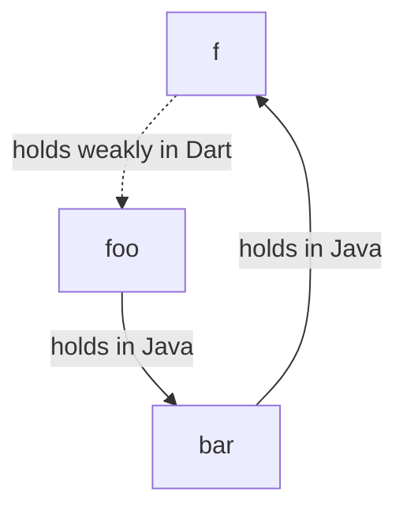

## Lifecycle of Java objects

All Java classes generated by `package:jnigen` extend `JObject`. In JNI there
are several kinds of references: local, global, and weak global. Local
references are tied to a single thread. To enable seamless transfer of
`JObject`s between isolates and safe usage in asynchronous code, `JObject`s
always use **global** references. It's crucial to remember that there's a limit
of approximately 50,000 global references.

Once all references (in both Java and Dart) to an object are gone, Java's
garbage collector (GC) can reclaim it.

### Automatic reference management

`JObject`s attach a native finalizer to their global references. Therefore, when
the Dart GC collects them, the underlying Java reference is released.

This approach works well for application code where a large number of references
aren't created repeatedly. However, it's not ideal for packages because the
usage patterns are unpredictable. This can lead to exceeding the global
reference limit and application crashes.

### Eagerly releasing references manually (recommended for packages)

Instead of waiting for Dart GC to release the JNI global references,
`.release()` can be called on the `JObject`s.

```dart
// Construct the object.
final hello = 'Hello'.toJString();
// Use it.
print(hello);
// Eagerly release it!
hello.release();
```

To make releasing easier, we can use
[`Arena`](https://pub.dev/documentation/ffi/latest/ffi/Arena-class.html)s.
First, create an `Arena` via
[`using`](https://pub.dev/documentation/ffi/latest/ffi/using.html). Then
register the object to be released at the end of the callback.

```dart
using((arena) {
  final hello = 'Hello'.toJString()..releasedBy(arena);
  final world = 'World'.toJString()..releasedBy(arena);
  print(hello);
  print(world);
});
// Both `hello` and `world` are now released.
```

### Lifecycle of interfaces implemented in Dart

Java interfaces can be implemented in Dart using `.implement`. The Dart closure
implementations must remain accessible as long as the created Java object
exists. Ownership of these Dart objects is transferred to Java. When the Java GC
reclaims the implemented object, a message is sent to Dart to remove the
corresponding closures.

> [!WARNING]
>
> One could create cycles between Dart and Java GC's when implementing
> interfaces. For example consider the following:
>
> ```dart
> final foo = Foo();
> foo.bar = Bar.implement($Bar(
>   f: () {
>    return foo;
>   }
> ));
> ```
>
> In Dart, closure `f` holds a reference to `foo`, preventing its garbage
> collection. In Java, `foo` holds a reference to `bar`, preventing its release
> and thus preventing the closure's removal. This creates a cycle.
>
> ```mermaid
> graph TD;
>    f-->|holds in Dart|foo;
>    foo-->|holds in Java|bar;
>    bar-->|holds in Java|f;
> ```

To prevent cycles, use
[`WeakReference`](https://api.dart.dev/dart-core/WeakReference-class.html)s.

```dart
final weakFoo = WeakReference(foo);
foo.bar = Bar.implement($Bar(
  f: () {
    final foo = weakFoo.target;
    if (foo == null) {
      throw StateError();
    }
    return foo;
  }
));
```

The weak reference breaks the cycle, allowing the GCs to collect the objects.



> [!WARNING]
>
> Be careful about the closures accidentally overcapturing. To prevent
> overcapturing, implement your logic in a separate function or create a class
> that implements `$Bar`.

### Tips on keeping the number of global references low

- Avoid storing `JObject`s in Dart collections like `List` or `Map`. Use Java
  collections such as `JList` or `JMap` instead.

  ```dart
  // GOOD:
  final jstrings = JList(JString.type);
  using((arena) {
    final hello = 'Hello'.toJString()..releasedBy(arena);
    final world = 'World'.toJString()..releasedBy(arena);
    jstrings.add(hello); // Add to Java collection
    jstrings.add(world); // Add to Java collection
  });
  print(jstrings.length); // prints 2.
  ```

This approach avoids storing individual references. References are created only
when accessing elements and released afterward.

- Minimize the use of `static` or global `JObject`s to prevent them from being
  reclaimed.
- When an original Java object is no longer needed, set `releaseOriginal` to
  `true` during conversion to Dart equivalents or casting.

  ```dart
  final foo = Foo();
  final String string = foo.someJString().toDartString(releaseOriginal: true);
  final JInteger jint =
        foo.someJNumber().as(JInteger.type, releaseOriginal: true);
  final int dartInt = castedAsInteger.intValue(releaseOriginal: true);
  foo.release();
  // All references are removed.
  ```
