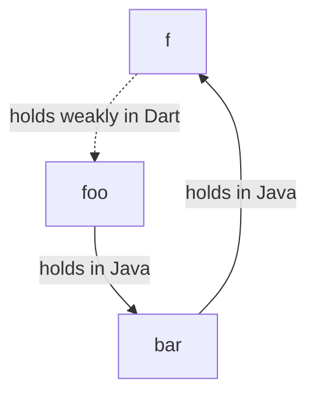

## Lifecycle of Java objects

All Java classes generated by `package:jnigen` extend `JObject`. In JNI there
are several kinds of references: local, global, and weak global. Local
references are bound to a single thread. To make it seamless to send `JObject`s
between isolates and use them safely in async code, `JObject`s always hold
**global** references. It's important to note that there is a limit of about
50000 on the number of global references.

Once there are no references (both in Java and in Dart) to an object, that
object can be garbage collected at some point by Java's GC.

### Automatic reference management

`JObject`s attach a native finalizer to their global references, so when they
get garbage collected by Dart GC, their underlying reference gets released.

This is fine for **application** code where we know that a lot references are
not created in a loop. However, it's not recommended for packages, since it's
not known how the user will call their APIs. This could lead to accidentally
hitting the global reference limit and crashing.

### Eagerly releasing references manually (recommended for packages)

Instead of waiting for Dart GC to release the JNI global references,
`.release()` can be called on the `JObject`s.

```dart
// Construct the object.
final hello = 'Hello'.toJString();
// Use it.
print(hello);
// Eagerly release it!
hello.release();
```

To make releasing easier, we can use
[`Arena`](https://pub.dev/documentation/ffi/latest/ffi/Arena-class.html)s.
First, create an `Arena` via
[`using`](https://pub.dev/documentation/ffi/latest/ffi/using.html). Then
register the object to be released at the end of the callback.

```dart
using((arena) {
  final hello = 'Hello'.toJString()..releasedBy(arena);
  final world = 'World'.toJString()..releasedBy(arena);
  print(hello);
  print(world);
});
// Both `hello` and `world` are now released.
```

### Lifecycle of interfaces implemented in Dart

Java interfaces can be implemented in Dart using `.implement`. The Dart closures
for these implementations must remain accessible while the created Java object
is alive. So the ownership of these Dart objects is transferred to Java. When
the implemented object gets GC'd by Java, a message is sent back to Dart to
remove the corresponding closures.

> [!WARNING]
>
> One could create cycles between Dart and Java GC's when implementing
> interfaces. For example consider the following:
>
> ```dart
> final foo = Foo();
> foo.bar = Bar.implement($Bar(
>   f: () {
>    return foo;
>   }
> ));
> ```
>
> From the Dart side, closure `f` holds a reference to `foo` keeping it from
> being GC'd. From the Java side, `foo` holds a reference to `bar` keeping it
> from being released and hence removing the closure.
>
> ```mermaid
> graph TD;
>    f-->|holds in Dart|foo;
>    foo-->|holds in Java|bar;
>    bar-->|holds in Java|f;
> ```

To prevent cycles, use
[`WeakReference`](https://api.dart.dev/dart-core/WeakReference-class.html)s.

```dart
final weakFoo = WeakReference(foo);
foo.bar = Bar.implement($Bar(
  f: () {
    final foo = weakFoo.target;
    if (foo == null) {
      throw StateError();
    }
    return foo;
  }
));
```

The weak reference breaks the cycle in Dart no longer preventing the GC's from collecting the objects.



> [!WARNING]
>
> Be careful about the closures accidentally overcapturing. To prevent
> overcapturing, do your implementation is a separate function or create a class
> that implements `$Bar`.

### Tips on keeping the number of global references low

- Do not store your `JObject`s in a Dart collection like a `List` or a `Map`.
  Instead, store them in a Java collection like a `JList` or a `JMap`.

  ```dart
  // GOOD:
  final jstrings = JList(JString.type);
  using((arena) {
    final hello = 'Hello'.toJString()..releasedBy(arena);
    final world = 'World'.toJString()..releasedBy(arena);
    jstrings.add(hello);
    jstrings.add(world);
  });
  print(jstrings.length); // prints 2.
  ```

This way, each individual reference is not stored. Instead the reference is only
created when accessing a certain element and can be released after use.

- Do not have too many `static` or global `JObject`s. This prevents them from
  being released.
- When you don't want the original object anymore, set `releaseOriginal` to
  `true` when converting Java object to their Dart equivalents or when casting.

  ```dart
  final foo = Foo();
  final String string = foo.someJString().toDartString(releaseOriginal: true);
  final JInteger jint =
        foo.someJNumber().as(JInteger.type, releaseOriginal: true);
  final int dartInt = castedAsInteger.intValue(releaseOriginal: true);
  foo.release();
  // All references are removed.
  ```
