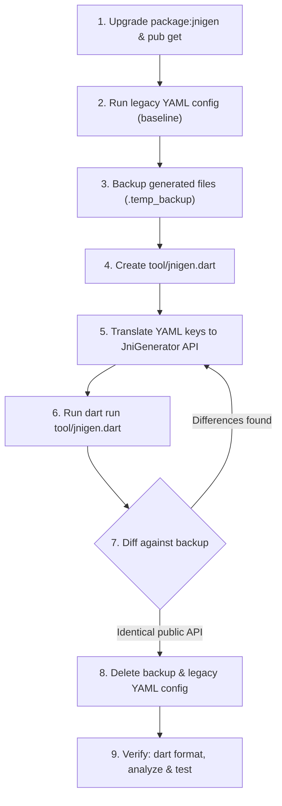

# Migrating JNIgen YAML Configuration to Modern Dart Code

## Contents
- [Introduction & Motivation](#introduction--motivation)
- [Step-by-Step Migration Workflow](#step-by-step-migration-workflow)
- [Comprehensive YAML to Dart API Mapping](#comprehensive-yaml-to-dart-api-mapping)
  - [1. Input & Java API Discovery](#1-input--java-api-discovery)
  - [2. Output Configuration](#2-output-configuration)
  - [3. Maven Dependencies](#3-maven-dependencies)
  - [4. Android SDK & Gradle Integration](#4-android-sdk--gradle-integration)
  - [5. Symbol Imports & Class Hiding](#5-symbol-imports--class-hiding)
  - [6. Nullability Annotations](#6-nullability-annotations)
  - [7. Logging & Execution](#7-logging--execution)
  - [8. Obsolete, Removed & Deprecated Fields](#8-obsolete-removed--deprecated-fields)
  - [9. Modern Dart-Only Capabilities](#9-modern-dart-only-capabilities)
- [Before & After Migration Examples](#before--after-migration-examples)
  - [Example 1: Android SDK & Gradle Flutter Plugin](#example-1-android-sdk--gradle-flutter-plugin)
  - [Example 2: Maven Java Library (Multi-File Package Structure)](#example-2-maven-java-library-multi-file-package-structure)
  - [Example 3: Cross-Package Symbol Imports & Nullability](#example-3-cross-package-symbol-imports--nullability)
  - [Example 4: Legacy Dart + C Bindings Migration](#example-4-legacy-dart--c-bindings-migration)
  - [Example 5: AST Filtering & Renaming with Modern Visitors](#example-5-ast-filtering--renaming-with-modern-visitors)
- [Verification Checklist](#verification-checklist)
- [Troubleshooting & Common Pitfalls](#troubleshooting--common-pitfalls)

---

## Introduction & Motivation

Historically, `package:jnigen` used static YAML configuration specified either in a standalone `jnigen.yaml` file or under the `jnigen:` key in `pubspec.yaml`, executed via `dart run jnigen`.

Starting with `jnigen` 1.0+, programmatic configuration in a dedicated Dart script (typically `tool/jnigen.dart`) using `JniGenerator` is the standard and recommended approach:
1. **Compile-Time Safety & Autocomplete**: Benefit from static typing, IDE code completion, and immediate compile-time errors instead of cryptic runtime YAML parsing failures.
2. **Full Dart Power**: Use arbitrary Dart logic (loops, sets, regular expressions, environment variables, closures) and AST `Visitor` passes for renaming and fine-grained symbol filtering.
3. **Future Proofing**: YAML configuration support is being phased out in favor of programmatic Dart configuration scripts across the Dart native interop ecosystem (`jnigen`, `ffigen`).
4. **Direct Path Resolution**: Reliable path resolution via `Platform.script.resolve('../')` avoids directory-dependent path breakage when running code generators from subdirectories or CI pipelines.

---

## Step-by-Step Migration Workflow

Follow this systematic 9-step workflow to migrate any package from YAML configuration to a modern Dart generator script without introducing breaking changes or unintended diffs:



### Step 1: Upgrade `package:jnigen` and Update Dependencies
Ensure the package has the latest `jnigen` dependency under `dev_dependencies` in `pubspec.yaml`:
```bash
dart pub add dev:jnigen
```
Run `dart pub get` (or `flutter pub get` for Flutter projects) to update lockfiles and dependencies.

### Step 2: Establish a Clean Baseline
Before making any changes, run the existing legacy YAML generator to ensure that the current bindings are cleanly generated and reproducible:
```bash
# If config is in jnigen.yaml or pubspec.yaml:
dart run jnigen

# Or if a custom config file was used:
dart run jnigen --config jnigen.yaml
```
Verify that `git status` reflects a clean working tree (or commit existing changes first). If there are significant changes to the bindings output due to upgrading jnigen, inform the user.

### Step 3: Copy Existing Generated Bindings to a Temporary Backup
Make a temporary copy of every generated file or directory so that the newly generated bindings can be diffed line-by-line. For example:

- **Single-file layout**:
  ```bash
  cp lib/src/generated_bindings.dart lib/src/generated_bindings.temp_backup.dart
  ```
- **Package-structure layout (multi-file directory)**:
  ```bash
  cp -r lib/src/third_party lib/src/third_party_temp_backup
  ```
- **Generated symbol file (`symbols.yaml`) (if applicable)**:
  ```bash
  cp symbols.yaml symbols.temp_backup.yaml
  ```

### Step 4: Create the Dart Configuration Script
Create the generator entrypoint. The typical location is `tool/jnigen.dart`:

```dart
import 'dart:io';
import 'package:jnigen/jnigen.dart';

void main() async {
  final packageRoot = Platform.script.resolve('../');
  final generator = JniGenerator(
    // Configuration translated in Step 5...
  );
  await generator.generate();
}
```

### Step 5: Translate YAML Keys into Modern Dart API
Inspect the legacy YAML configuration and systematically translate each section into `JniGenerator` parameters using the [Comprehensive YAML to Dart API Mapping](#comprehensive-yaml-to-dart-api-mapping) below:

The most important change is that filtering and renaming is now performed using `Visitor`s.

### Step 6: Execute the New Generator Script
Run the newly created generator script from the package root:
```bash
dart run tool/jnigen.dart
```

### Step 7: Diff Newly Generated Bindings Against the Backup
Compare the new output with the temporary backup:

- **For single-file output**:
  ```bash
  git diff --no-index lib/src/generated_bindings.temp_backup.dart lib/src/generated_bindings.dart
  ```
- **For directory / package structure output**:
  ```bash
  git diff --no-index lib/src/third_party_temp_backup lib/src/third_party
  ```

**Verification rules**:
- **Allowed diffs**: Trivial differences such as formatting, renaming of internal-only methods or variables, reordering of the bindings, or the names of positional parameters.
- **Forbidden diffs**: Any differences in public APIs, class names, method signatures, field types, etc. It's critical that there are no breaking changes, but we also don't want to add new classes or methods unnecessarily.
- If unintended diffs exist, adjust the script and re-run until the diff is clean.

### Step 8: Clean Up Legacy Files and References
1. Delete the temporary backup files:
   ```bash
   rm -rf lib/src/*.temp_backup* lib/src/*_temp_backup
   ```
2. Remove the legacy YAML configuration:
   - If using `jnigen.yaml`, delete the file (`rm jnigen.yaml`).
   - If the configuration is inside `pubspec.yaml`, remove the `jnigen:` section entirely.
3. Update repository scripts and documentation:
   - Update any `README.md` instructions referencing `dart run jnigen` to `dart run tool/jnigen.dart`.
   - Update any CI workflows (e.g., `.github/workflows/*.yml`), Makefile targets, or build scripts to invoke `dart run tool/jnigen.dart`.

### Step 9: Final Verification Loop (Format, Analyze, Test)
Execute the complete Dart verification suite in the target package root:
1. **Format code**:
   ```bash
   dart format .
   ```
   Ensures both `tool/jnigen.dart` and generated files adhere to canonical Dart formatting.
2. **Static analysis**:
   ```bash
   dart analyze
   ```
   Ensures zero errors, warnings, or lints across the entire package. If generated bindings trigger lints, append the appropriate `// ignore_for_file:` directives to the `preamble` of `Output` in `tool/jnigen.dart` (never disable lints globally in `analysis_options.yaml`).
3. **Run tests**:
   ```bash
   dart test
   ```
   Ensures all unit, integration, and JNI runtime tests execute and pass cleanly.

---

## Comprehensive YAML to Dart API Mapping

### 1. Input & Java API Discovery

All input sources, classes, classpaths, and Java summarizer settings map into `Input(...)`:

| Legacy YAML Key | Type | Modern Dart API Equivalent | Notes |
| :--- | :--- | :--- | :--- |
| `classes` * | `List<String>` | `Input(classes: ['com.example.MyClass', 'com.example.pkg'])` | Target classes or packages. Specifying a parent class pulls in nested classes. Do not use `$` notation for nested classes. |
| `source_path` | `List<String>` | `Input(sourcePath: [packageRoot.resolve('android/src/main/java')])` | Directories to search for Java source files. Takes `List<Uri>`. |
| `class_path` | `List<String>` | `Input(classPath: [packageRoot.resolve('libs/library.jar')])` | Paths to JAR files or directories for compiled Java classes. Takes `List<Uri>`. |
| `summarizer.backend` | `'auto'`, `'doclet'`, or `'asm'` | `Input(backend: SummarizerBackend.asm)` | Backend engine for summarizer. `auto` in YAML is represented by omitting `backend` (defaults to `null`). |
| `summarizer.extra_args` | `List<String>` | `Input(extraArgs: ['-Xlint:none'])` | Extra CLI arguments passed directly to the summarizer tool. |
| `summarizer.working_dir` | `String` | `Input(workingDirectory: packageRoot.resolve('build/'))` | Working directory where summarizer executes. Defaults to `Uri.directory('.')`. |
| `summarizer.command` | `String` | `Input(summarizerCommand: 'java -jar /path/to/ApiSummarizer.jar')` | Command used to invoke a prebuilt summarizer JAR instead of compiling it with Gradle. |

### 2. Output Configuration

Dart code emission, file structure, symbol export, and header comments map into `Output(...)` and `DartOutput(...)`:

| Legacy YAML Key | Type | Modern Dart API Equivalent | Notes |
| :--- | :--- | :--- | :--- |
| `output.dart.path` * | `String` | `Output(dart: DartOutput(path: packageRoot.resolve('lib/bindings.dart')))` | Primary Dart bindings output path (`Uri`). For single-file mode, must end in `.dart`. For package structure, must end in `/` or use `Uri.directory`. |
| `output.dart.structure` | `'single_file'` or `'package_structure'` | `DartOutput(..., structure: OutputStructure.singleFile)` | Layout mode: `OutputStructure.singleFile` or `OutputStructure.packageStructure` (default). |
| `output.symbols` | `String` | `Output(..., symbols: SymbolsOutput(packageRoot.resolve('symbols.yaml')))` | Path to export generated symbol definitions (`Uri`). Must end in `.yaml`. |
| `preamble` | `String` | `Output(..., preamble: '// Header comments\n')` | Header string injected at the top of every generated Dart file (licenses, lints suppression). |
| `generate_stubs` | `bool` | `Output(..., generateStubs: true)` | Generates minimal Dart stubs for referenced but unincluded Java classes. Defaults to `true`. |
| `format` | `bool` | `Output(..., format: true)` | Automatically runs `dart format` on generated files. Defaults to `true`. |

### 3. Maven Dependencies

Automatic downloading of Maven source jars and compiled jars maps into `MavenDownloads(...)` under `Input(mavenDownloads: ...)`:

| Legacy YAML Key | Type | Modern Dart API Equivalent | Notes |
| :--- | :--- | :--- | :--- |
| `maven_downloads.source_deps` | `List<String>` | `MavenDownloads(sourceDeps: ['org.apache.pdfbox:pdfbox:2.0.26'])` | Maven dependencies (`groupId:artifactId:version`) to download and unpack sources for. Sources are automatically added to `sourcePath`. |
| `maven_downloads.source_dir` | `String` | `MavenDownloads(sourceDir: packageRoot.resolve('mvn_java/'))` | Directory where Maven sources are extracted (`Uri`). Defaults to `mvn_java/`. |
| `maven_downloads.jar_only_deps` | `List<String>` | `MavenDownloads(jarOnlyDeps: ['org.slf4j:slf4j-api:1.7.36'])` | Maven dependencies to download JARs for only (without sources). JARs are automatically added to `classPath`. |
| `maven_downloads.jar_dir` | `String` | `MavenDownloads(jarDir: packageRoot.resolve('mvn_jar/'))` | Directory where Maven JARs are stored (`Uri`). Defaults to `mvn_jar/`. |

### 4. Android SDK & Gradle Integration

Android platform stub resolution and Gradle classpath discovery map into `AndroidSdk(...)` under `Input(androidSdk: ...)`:

| Legacy YAML Key | Type | Modern Dart API Equivalent | Notes |
| :--- | :--- | :--- | :--- |
| `android_sdk_config.versions` | `List<int>` | `AndroidSdk(versions: [34, 33])` | Android SDK API versions to search in decreasing preference order. |
| `android_sdk_config.sdk_root` | `String` | `AndroidSdk(sdkRoot: Uri.directory('/path/to/android-sdk'))` | Custom Android SDK installation directory (`Uri`). If omitted, uses the `ANDROID_SDK_ROOT` environment variable. |
| `android_sdk_config.add_gradle_deps` | `bool` | `AndroidSdk(addGradleDeps: true)` | Runs a Gradle stub to determine the actual compile classpath of the Android subproject. Requires `flutter pub get` beforehand. Defaults to `false`. |
| `android_sdk_config.add_gradle_sources` | `bool` | `AndroidSdk(addGradleSources: true)` | Runs a Gradle stub to obtain source dependencies of the Android project. Defaults to `false`. |
| `android_sdk_config.android_example` | `String` | `AndroidSdk(androidExample: packageRoot.resolve('example/'))` | Relative directory path (`Uri`) to the example application for Flutter plugin projects. Defaults to `.`. |

### 5. Symbol Imports & Class Hiding

Reusing symbols exported from other packages (such as `package:jni/jni_symbols.yaml`) maps into `SymbolImports(...)`:

| Legacy YAML Key | Type | Modern Dart API Equivalent | Notes |
| :--- | :--- | :--- | :--- |
| `import` | `List<String>` | `JniGenerator(imports: SymbolImports(symbolFiles: [Uri.parse('package:other_pkg/symbols.yaml')]))` | List of symbol file URIs to import. Note: `package:jni/jni_symbols.yaml` is imported implicitly by JNIgen. |
| `hide` | `List<String>` | `JniGenerator(imports: SymbolImports(hide: ['java.lang.String']))` | Fully-qualified binary class names to hide/exclude from the imported symbol files to prevent collisions. |

### 6. Nullability Annotations

Custom Java annotations indicating nullability map into `NullabilityAnnotations(...)`:

| Legacy YAML Key | Type | Modern Dart API Equivalent | Notes |
| :--- | :--- | :--- | :--- |
| `non_null_annotations` | `List<String>` | `JniGenerator(nullability: NullabilityAnnotations(nonNull: ['com.myorg.NonNull', 'androidx.annotation.NonNull']))` | List of fully-qualified class names for custom `@NonNull` annotations. |
| `nullable_annotations` | `List<String>` | `JniGenerator(nullability: NullabilityAnnotations(nullable: ['com.myorg.Nullable', 'androidx.annotation.Nullable']))` | List of fully-qualified class names for custom `@Nullable` annotations. |

### 7. Logging & Execution

| Legacy YAML Key | Type | Modern Dart API Equivalent | Notes |
| :--- | :--- | :--- | :--- |
| `log_level` | `'verbose'`, `'info'`, `'warning'`, or `'error'` | `await generator.generate(logger: Logger('jnigen')..level = Level.WARNING);` | In modern JNIgen, `logLevel` is not a property on `JniGenerator`. Pass a `Logger` from `package:logging` to `generator.generate(logger: ...)` or configure `Logger.root.level`. |

### 8. Obsolete, Removed & Deprecated Fields

| Legacy YAML Field | Status | Replacement / Migration Action |
| :--- | :--- | :--- |
| `output.c` / `c_root` | **Removed** | Obsolete. Modern JNIgen generates pure Dart FFI bindings that call JNI functions directly through `package:jni`, eliminating the need for C wrapper code or CMake builds. Remove these keys. |
| `experiments` | **Removed** | Experimental features (e.g. `suspend_fun_to_async: true`) were stabilized or removed in `jnigen` 1.0+. Remove the `experiments:` block. |
| `bindings_type` | **Removed** | Replaced by pure Dart FFI bindings. |
| `Config` class name | **Renamed** | Renamed to `JniGenerator` in Dart API to align with `package:ffigen` (`FfiGenerator`). |
| `OutputConfig` class name | **Renamed** | Renamed to `Output` in Dart API. |
| `DartCodeOutput` class name | **Renamed** | Renamed to `DartOutput` in Dart API. |
| `generateJniBindings(...)` | **Renamed** | Replaced by `await generator.generate()` extension method on `JniGenerator`. |

## Before & After Migration Examples

### Example 1: Android SDK & Gradle Flutter Plugin

Migrating an Android Flutter plugin that binds Java classes from the application source and Gradle dependencies:

#### BEFORE: `jnigen.yaml`
```yaml
output:
  dart:
    path: lib/src/android_utils.g.dart
    structure: single_file

classes:
  - 'com.example.in_app_java'
  - 'androidx.emoji2.text.EmojiCompat'
  - 'android.os.Build'

source_path:
  - 'android/app/src/main/java'

android_sdk_config:
  add_gradle_deps: true
  android_example: '.'

preamble: |
  // Autogenerated by jnigen. Do not edit directly.
  // ignore_for_file: type=lint, unused_element, unused_field
```

#### AFTER: `tool/jnigen.dart`
```dart
import 'dart:io';
import 'package:jnigen/jnigen.dart';

void main() async {
  final packageRoot = Platform.script.resolve('../');

  final generator = JniGenerator(
    input: Input(
      classes: [
        'com.example.in_app_java',
        'androidx.emoji2.text.EmojiCompat',
        'android.os.Build',
      ],
      sourcePath: [
        packageRoot.resolve('android/app/src/main/java/'),
      ],
      androidSdk: AndroidSdk(
        addGradleDeps: true,
        androidExample: packageRoot,
      ),
    ),
    output: Output(
      dart: DartOutput(
        path: packageRoot.resolve('lib/src/android_utils.g.dart'),
        structure: OutputStructure.singleFile,
      ),
      preamble: '// Autogenerated by jnigen. Do not edit directly.\n'
          '// ignore_for_file: type=lint, unused_element, unused_field\n',
    ),
  );

  await generator.generate();
}
```

---

### Example 2: Maven Java Library (Multi-File Package Structure)

Migrating a standalone Dart application using Apache PDFBox downloaded via Maven:

#### BEFORE: `jnigen.yaml`
```yaml
maven_downloads:
  source_deps:
    - 'org.apache.pdfbox:pdfbox:2.0.26'
  source_dir: third_party/java/
  jar_dir: third_party/jar/

output:
  dart:
    path: lib/src/third_party/
    structure: package_structure
  symbols: symbols.yaml

classes:
  - 'org.apache.pdfbox.pdmodel.PDDocument'
  - 'org.apache.pdfbox.pdmodel.PDPage'
  - 'org.apache.pdfbox.text.PDFTextStripper'

preamble: |
  // Copyright (c) 2026, the Dart project authors.
  // Licensed under the Apache License 2.0.

log_level: warning
```

#### AFTER: `tool/jnigen.dart`
```dart
import 'dart:io';
import 'package:jnigen/jnigen.dart';
import 'package:logging/logging.dart';

void main() async {
  final packageRoot = Platform.script.resolve('../');

  final generator = JniGenerator(
    input: Input(
      classes: [
        'org.apache.pdfbox.pdmodel.PDDocument',
        'org.apache.pdfbox.pdmodel.PDPage',
        'org.apache.pdfbox.text.PDFTextStripper',
      ],
      mavenDownloads: MavenDownloads(
        sourceDeps: [
          'org.apache.pdfbox:pdfbox:2.0.26',
        ],
        sourceDir: packageRoot.resolve('third_party/java/'),
        jarDir: packageRoot.resolve('third_party/jar/'),
      ),
    ),
    output: Output(
      dart: DartOutput(
        path: packageRoot.resolve('lib/src/third_party/'),
        structure: OutputStructure.packageStructure,
      ),
      symbols: SymbolsOutput(packageRoot.resolve('symbols.yaml')),
      preamble: '// Copyright (c) 2026, the Dart project authors.\n'
          '// Licensed under the Apache License 2.0.\n',
    ),
  );

  final logger = Logger('jnigen')..level = Level.WARNING;
  await generator.generate(logger: logger);
}
```

---

### Example 3: Cross-Package Symbol Imports & Nullability

Migrating an enterprise library importing external symbols, hiding overlapping declarations, and configuring nullability annotations:

#### BEFORE: `jnigen.yaml`
```yaml
import:
  - 'package:base_java_bindings/symbols.yaml'

hide:
  - 'com.myorg.base.InternalHelper'

non_null_annotations:
  - 'androidx.annotation.NonNull'
  - 'org.jetbrains.annotations.NotNull'

nullable_annotations:
  - 'androidx.annotation.Nullable'
  - 'org.jetbrains.annotations.Nullable'

output:
  dart:
    path: lib/src/service_bindings.dart
    structure: single_file
  generate_stubs: true

classes:
  - 'com.myorg.service.PaymentService'
  - 'com.myorg.service.PaymentResult'

class_path:
  - 'libs/service-sdk.jar'
```

#### AFTER: `tool/jnigen.dart`
```dart
import 'dart:io';
import 'package:jnigen/jnigen.dart';

void main() async {
  final packageRoot = Platform.script.resolve('../');

  final generator = JniGenerator(
    input: Input(
      classes: [
        'com.myorg.service.PaymentService',
        'com.myorg.service.PaymentResult',
      ],
      classPath: [
        packageRoot.resolve('libs/service-sdk.jar'),
      ],
    ),
    output: Output(
      dart: DartOutput(
        path: packageRoot.resolve('lib/src/service_bindings.dart'),
        structure: OutputStructure.singleFile,
      ),
      generateStubs: true,
    ),
    imports: SymbolImports(
      symbolFiles: [
        Uri.parse('package:base_java_bindings/symbols.yaml'),
      ],
      hide: [
        'com.myorg.base.InternalHelper',
      ],
    ),
    nullability: const NullabilityAnnotations(
      nonNull: [
        'androidx.annotation.NonNull',
        'org.jetbrains.annotations.NotNull',
      ],
      nullable: [
        'androidx.annotation.Nullable',
        'org.jetbrains.annotations.Nullable',
      ],
    ),
  );

  await generator.generate();
}
```

---

## Verification Checklist

Always complete this checklist before finishing the migration task:

- [ ] **Dependency Setup**: `pubspec.yaml` has `package:jnigen` in `dev_dependencies` and `package:jni` in `dependencies`.
- [ ] **Baseline Established**: Legacy YAML config was run once before creating the new script to establish a clean working state.
- [ ] **Temporary Backup**: Existing generated bindings (and symbol files) were copied to `.temp_backup` files.
- [ ] **Dart Script Executable**: `tool/jnigen.dart` created with `Platform.script.resolve('../')` for portable relative path resolution.
- [ ] **Identical Public API**: `git diff --no-index` between backup and new output confirms identical types, classes, methods, parameters, and signatures.
- [ ] **Cleanup Completed**: Temporary backup files deleted, legacy `jnigen.yaml` (or `pubspec.yaml` `jnigen:` section) removed.
- [ ] **Documentation & CI Updated**: Commands in `README.md` and CI workflows updated from `dart run jnigen` to `dart run tool/jnigen.dart`.
- [ ] **Code Formatted**: Ran `dart format .` to format `tool/jnigen.dart` and generated files.
- [ ] **Static Analysis Clean**: Ran `dart analyze` with 0 warnings, 0 errors, and 0 lints.
- [ ] **Tests Pass**: Ran `dart test` and confirmed all existing unit, integration, and JNI tests succeed.

---

## Troubleshooting & Common Pitfalls

### 1. Directory Paths vs Single-File Output Paths
In `DartOutput`:
- In **single-file mode** (`OutputStructure.singleFile`), the path must end in `.dart` (e.g. `packageRoot.resolve('lib/bindings.dart')`).
- In **package structure mode** (`OutputStructure.packageStructure`), the path must be a directory ending in a trailing slash `/` or constructed via `Uri.directory(...)` (e.g. `packageRoot.resolve('lib/src/generated/')`).

### 2. Relative Paths Broken when Invoking from Subdirectories
If `tool/jnigen.dart` uses hardcoded relative strings (e.g. `Uri.file('lib/bindings.dart')`), running the script from anywhere other than the package root (e.g. inside `example/` or CI) will resolve paths incorrectly.
- **Solution**: Always anchor paths to `Platform.script`:
  ```dart
  final packageRoot = Platform.script.resolve('../');
  ```

### 3. Nested Class Syntax (`$` vs `.`)
In Java, nested classes are often referred to with `$` (e.g., `com.example.Outer$Inner`). In JNIgen:
- Specifying nested classes using `$` (e.g. `com.example.Outer$Inner`) throws a `ConfigException`.
- Specifying the outer class (e.g., `com.example.Outer`) automatically pulls in all its nested classes.
- Specify only the top-level outer class in `input.classes`.

### 4. Gradle Dependency Resolution & `flutter pub get`
When using `androidSdk: AndroidSdk(addGradleDeps: true)`:
- JNIgen runs a Gradle stub in the background to inspect the compile classpath.
- If dependencies have not been resolved yet, or if a Gradle `clean` was run, JNIgen will fail to find Android libraries.
- **Solution**: Run `flutter pub get` in the Flutter app (or the example app specified in `androidExample`) before executing `dart run tool/jnigen.dart`.

### 5. SDK Root Resolution on Android
If `versions` is specified under `AndroidSdk(versions: [...])`, JNIgen looks for the Android SDK directory:
- By default, it inspects the `ANDROID_SDK_ROOT` environment variable.
- If the environment variable is not set and `sdkRoot` is omitted, JNIgen throws a `ConfigException`.
- **Solution**: Either ensure `ANDROID_SDK_ROOT` is set, pass `sdkRoot: Uri.directory('/path/to/sdk')`, or omit `versions` when using `addGradleDeps: true` (Gradle will resolve the platform SDK automatically).

### 6. Lint Warnings in Generated Files
Static analysis (`dart analyze`) might flag lints on generated code (such as `camel_case_types`, `non_constant_identifier_names`, `unused_element`).
- **Solution**: Add the appropriate `// ignore_for_file:` directives to the `preamble` property of `Output` in `tool/jnigen.dart`. Never disable lints globally across the repository in `analysis_options.yaml`.

### 7. Missing Transitive Dependencies in Maven
`mavenDownloads.sourceDeps` downloads source JARs for specified Maven coordinates but does not automatically resolve optional or transitive runtime dependencies.
- **Solution**: If the Java summarizer complains about missing imported classes, add those dependencies under `mavenDownloads.jarOnlyDeps`.
